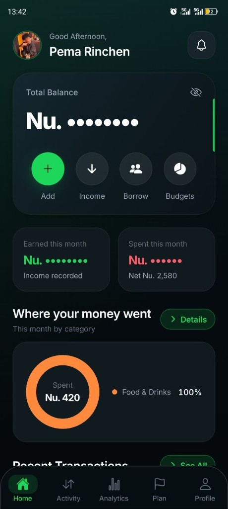
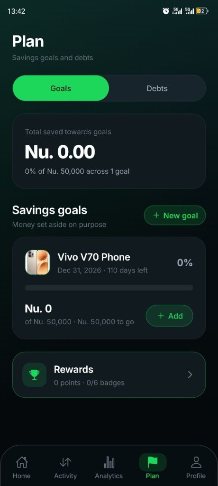

# CashFlow

A personal finance app by **Pema Rinchen**, built first for Bhutan. Amounts default to ngultrum (`Nu.`).

CashFlow answers one question at a glance: **where did my money go?**

**Live API:** [https://cash-flow-server-fawn.vercel.app](https://cash-flow-server-fawn.vercel.app)

## The problem

Most people in Bhutan already know they earn in ngultrum and spend in ngultrum. What they do not have is a clear picture of the rest:

- Money sits in more than one place — BOB, BNB, a wallet, cash — and nobody adds it up for you.
- A salary lands, then food, taxis, and small transfers eat it. By month end it is gone, and there is no honest total for *why*.
- Informal lending is normal. You borrow from a friend or lend to a cousin. That cash is not income and not spending, but it still moves your balance. Banking apps and generic expense trackers mix it in, so the numbers lie.
- Popular money apps assume dollars, card linking, and a bank feed. People here should not have to type a card or account number into a side project just to log lunch.
- Saving for something real (a phone, a trip, an emergency fund) is a wish until there is a target, a date, and a running total next to everyday spending.

Spreadsheets work until they do not. Notes apps forget. The result is the same: you cannot say what you hold, what you owe, or whether this month is under control.

## Who it is for

One person, one account. CashFlow is for someone who wants to log their own money on a phone — not a family ledger, not a shop, not a bank.

If you are in Bhutan (or you think in `Nu.`), it is meant to feel native. Currency can be switched; the product started here.

## The approach

CashFlow is a tracker you type into, not a bank connection.

- You add wallets and accounts by **name and balance only**. No card number, no account number, ever.
- Income and expenses are booked against an account and a category. The home screen totals the month and shows where it went.
- Debts with friends are a separate book. Borrowing raises cash; repayment lowers it; neither counts as earning or spending, and neither hits a budget.
- Savings goals are transfers, not expenses. Putting money toward a phone does not look like you spent it on shopping.
- Monthly category budgets sit next to the ledger so “over on food” is a fact, not a feeling.
- The signed-in account is the source of truth for the ledger, budgets, goals, debts, and photos. Face ID stays on the phone.

## What it does

- Sign in with email OTP and a password; unlock later with biometrics
- See net balance, this month’s income and spend, and a category breakdown
- Log transactions; search and filter the full ledger
- Set monthly category budgets
- Save toward a goal with a photo, a target, and a date
- Track money borrowed from or lent to someone
- Read analytics and a tracking streak
- Earn points and badges for logging (kept on the device)
- Hide balances, pick a currency, change password, or delete the account

## Screenshots

Home — balance, this month, and where the money went.



Plan — savings goals, debts, and rewards.



### Download these images

| Screen | File |
| --- | --- |
| Home | [Download home.jpg](docs/screenshots/home.jpg) |
| Plan | [Download plan.jpg](docs/screenshots/plan.jpg) |

Right-click a picture or the link and choose **Save as**. On GitHub, open the file and click **Download**.

### Download the Android app

- [All builds](https://expo.dev/accounts/pemarinchen12/projects/cashflow/builds)
- [Latest APK build](https://expo.dev/accounts/pemarinchen12/projects/cashflow/builds/c021c419-c762-4674-85cc-7d54cea9f427)

Allow **Install unknown apps**, then open the APK. An installed build talks to the Vercel API.

## What’s in this repo

| Folder | What it is | Docs |
| --- | --- | --- |
| `mobile/` | Expo / React Native phone app | [mobile/README.md](mobile/README.md) |
| `server/` | Express API (MongoDB Atlas, hosted on Vercel) | [server/README.md](server/README.md) |
| `docs/screenshots/` | The images above | [home.jpg](docs/screenshots/home.jpg) · [plan.jpg](docs/screenshots/plan.jpg) |

There is no root `package.json`. The two packages are installed and run on their own.

## Quick start

```bash
cd server && npm install && npm run dev
cd mobile && npm install && npx expo start
```

Fill `server/.env` from `server/.env.example` first. Scan the Expo QR on the same Wi-Fi as the computer.

To ship an APK that uses Vercel, from this folder:

```powershell
.\build-mobile.ps1
```

How the app picks a server, and how to work on the phone UI: [mobile/README.md](mobile/README.md).  
How to run and deploy the API: [server/README.md](server/README.md).

---

CashFlow · v1.0.0 · Made by Pema Rinchen
